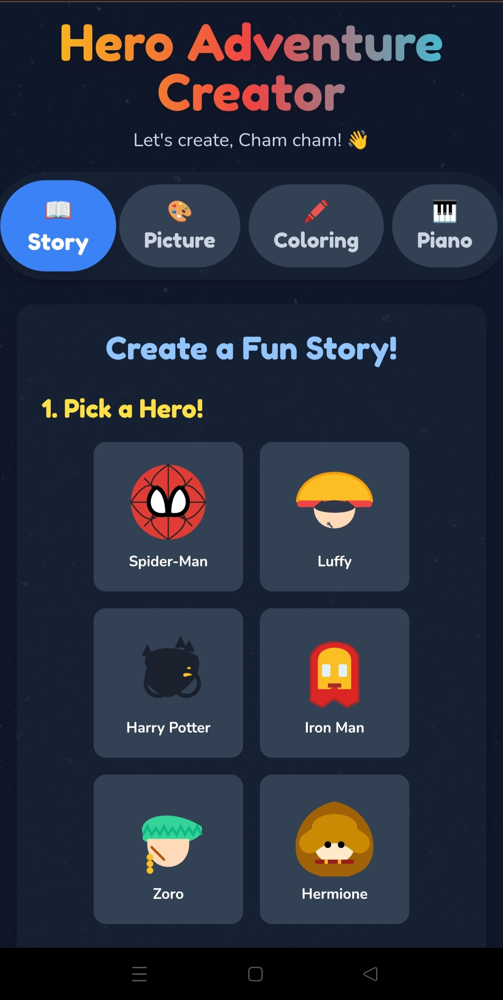
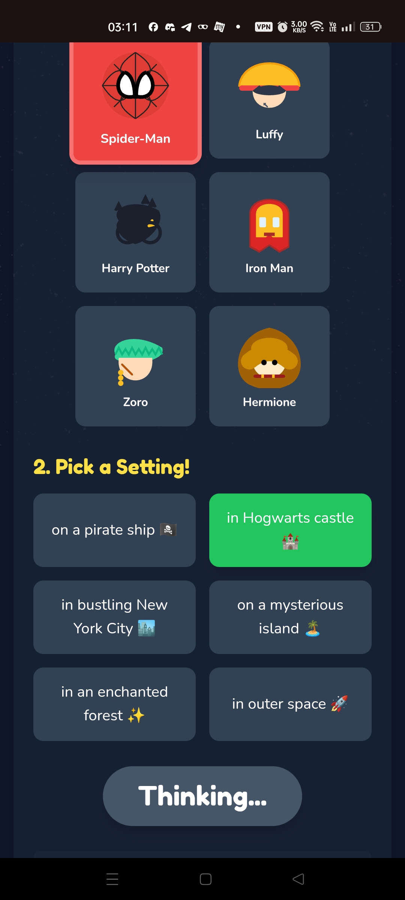
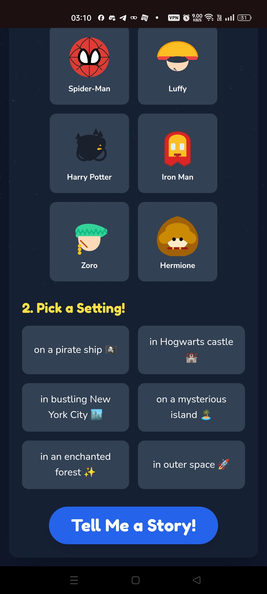
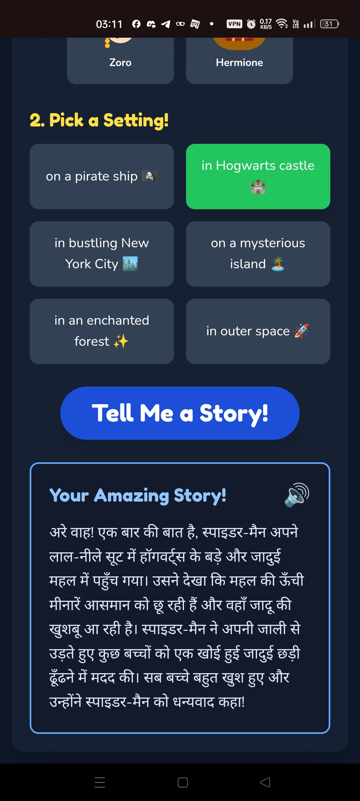
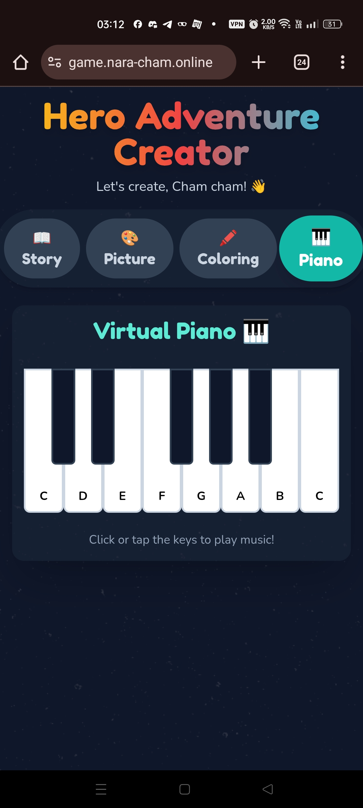

# PlaytimeFun: The Kid's Hero Adventure Creator

## 📖 The Story Behind the App
**"How I bought 2 days of peace with React and AI."**

This app wasn't built for a client or a hackathon. It was built for survival. Created to entertain a niece and nephew (ages 7-11) during a holiday visit, PlaytimeFun is a hyper-personalized entertainment hub. 

By using their favorite characters and their native "Hinglish" language style, the app kept them busy for 48 hours straight, allowing the developer uncle to code in peace. [Read the full Origin Story here](ORIGIN_STORY.md).

## ✨ Features
- **Story Generator**: Infinite stories in Hinglish using Google Gemini, featuring their favorite heroes in Indian settings.
- **Magic Art Studio**: AI-generated coloring pages and cartoons.
- **Interactive Piano**: A web-audio piano for musical breaks.
- **Read Aloud**: High-quality Text-to-Speech using ElevenLabs.

## 📸 Visual Showcase

<table>
  <tr>
    <td align="center"> <b>Choose Your Hero</b></td>
    <td align="center"> <b>Pick a Setting</b></td>
  </tr>
  <tr>
    <td align="center"> <b>Read Amazing Stories</b></td>
    <td align="center"> <b>Make Music</b></td>
  </tr>
</table>

## 🚀 Run Locally

**Prerequisites:**  Node.js

1. Install dependencies:
   `npm install`
2. Set the `GEMINI_API_KEY` in [.env.local](.env.local) to your Gemini API key
3. Run the app:
   `npm run dev`

## 🛠️ Tech Stack
- **Frontend**: React 19, TypeScript, Vite, Tailwind CSS
- **AI**: Google Gemini API (`@google/genai`)
- **Audio**: Web Audio API, ElevenLabs (via Supabase Edge Functions)
- **Deployment**: Google Cloud Run

## ⚠️ Note on Development
This is a personal project built for a specific use case (entertaining family). As such:
- **Testing**: Basic testing infrastructure is set up, but extensive coverage is not a priority.
- **Accessibility & Offline**: These features are not implemented as the app is designed for supervised use in a connected environment.
- **Error Handling**: Focus is on graceful degradation if APIs fail, rather than robust offline support.

View your app in AI Studio: https://ai.studio/apps/drive/1-0M_QbbT6iFh2LZKaRUCfPXHqQyKM22m

